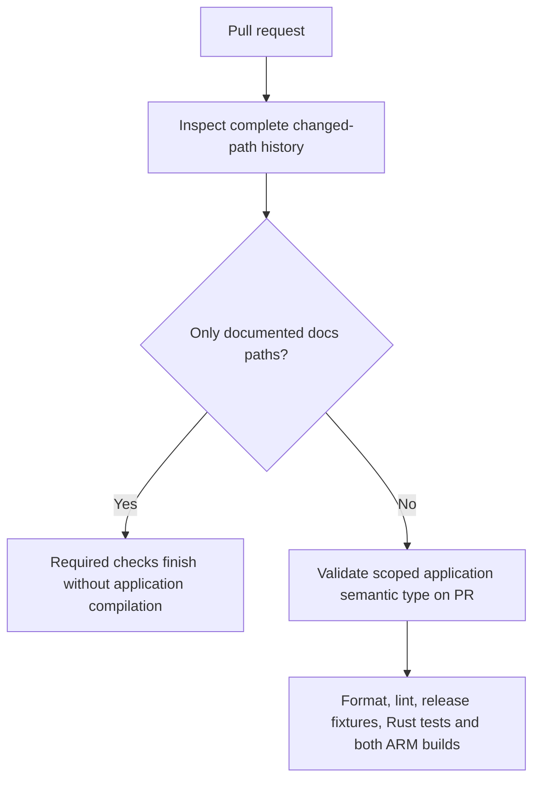
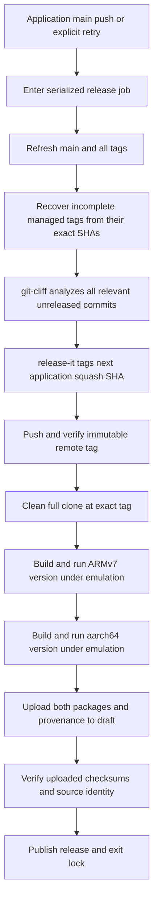

# CI/CD workflow

The scoped PR title becomes the squash commit message. See
[release policy](../release/cliff.toml) and [public release tests](../release/README.md).

## Pull requests and main CI



Unknown paths are relevant by default. A mixed code/docs change remains relevant;
application edits followed by reverts in the same push are not hidden by a net diff.
PR title edits rerun classification. A failed policy check fails the named required
checks; a documentation-only change finishes those checks successfully.

## Release ordering and retries



Documentation-only pushes never enter the release lock or compile the application.
A later documentation HEAD is not used as the release SHA. Queued application events
are drained in commit order, with one semantic tag and release per application merge.
Ordinary main CI only checks policy; all main compilation occurs after the tag.
No Cargo version commit is created. The tag precedes both release builds.

A failure retains the immutable tag and any draft for retry. Use the Release
workflow's Run workflow button on main or `gh workflow run release.yml --ref main`.
The next application push also recovers pending releases. A docs push remains
build-free even after a failed release. Published complete releases are verified
and skipped; their assets are not overwritten.

## Semantic mapping

| Relevant squash message | Version change |
| --- | --- |
| `feat(scope): ...` | Minor, including 0.x |
| `fix(scope): ...` | Patch |
| `perf`, `refactor`, `build`, `ci`, `chore`, `test`, `revert` with a scope | Patch |
| Scoped `!` or `BREAKING CHANGE:` footer | Major, including 0.x to 1.0 |
| Only documentation paths changed | None, regardless of type |
| Application paths with `docs` or unsupported/unscoped message | Visible validation failure |

A feature followed by a fix yields a minor release then a patch release, each on its own squash SHA. Pure docs
commits in that range are excluded. Both packaged binaries report the semantic
version from the same tag; provenance records its full source SHA and checksums.
Cargo's fixed package placeholder is never a release version source.

## User Experience Flow

```
┌─────────────────────────────────────────────────────────────────────────┐
│                        END USER WORKFLOW                                 │
└─────────────────────────────────────────────────────────────────────────┘

User Wants Reader Buddy
     │
     v
Navigate to GitHub Releases
     │
     v
Download Latest Release
     │
     ├─> reader-buddy-armv7-*.tar.gz (for RM2)
     └─> reader-buddy-aarch64-*.tar.gz (for RMPP)
     │
     v
Extract Binary
     │
     v
Copy to reMarkable
     │
     v
Set OPENAI_API_KEY
     │
     v
Run ./reader-buddy
     │
     v
✅ Using Reader Buddy!
```

